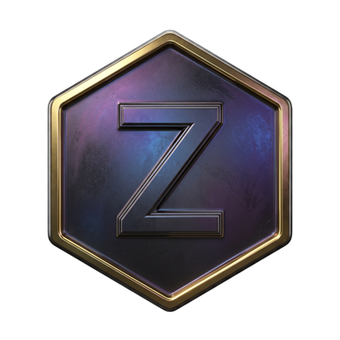

<div align="center">



# Zentra

### A proof-of-work **BlockDAG** Layer-1 cryptocurrency

Fast, parallel block production with **GhostDAG** consensus · CPU-mineable · solo &amp; pooled mining · a polished desktop wallet.

[](https://github.com/Jestag-CryptoJarcc/Zentra-Chain/releases)
[](LICENSE)
[](#status)

[Download](https://github.com/Jestag-CryptoJarcc/Zentra-Chain/releases/latest) ·
[Wiki](https://github.com/Jestag-CryptoJarcc/Zentra-Chain/wiki) ·
[Releases](https://github.com/Jestag-CryptoJarcc/Zentra-Chain/releases)

</div>

---

## What is Zentra?

Zentra is a Layer-1 cryptocurrency built around a **BlockDAG** instead of a single chain. Rather than throwing away blocks that are mined in parallel (orphans), Zentra organises every block into a Directed Acyclic Graph and orders them deterministically with **GhostDAG** consensus. More of the network's proof-of-work stays productive, and there are no wasteful orphan races.

The native asset is **ZTR**, with a fixed maximum supply of 50,000,000. New ZTR is minted as a block reward that halves roughly once a year. Transaction fees are paid to whoever mines the block that includes them.

## Status

> **Devnet.** Zentra is on Devnet while the network, tooling and security are hardened. Mainnet follows after a series of upgrades. The ports and addresses here target Devnet.

## Highlights

- **BlockDAG + GhostDAG** — parallel blocks are merged and ordered, not orphaned.
- **UTXO model** with full block validation (PoW, signatures, no double-spends, capped coinbase, coinbase maturity).
- **CPU mining** out of the box — one thread per physical core.
- **Shared mining pool** — every pool miner contributes to one pot; the operator splits rewards by hashrate.
- **Desktop Core Wallet** (`zentra-qt`) — hero balance dashboard, clickable transaction details, themes, optional seed encryption, and built-in auto-update.
- **Self-discovering P2P** — nodes ship with seed peers and exchange peer addresses, so the network meshes automatically.
- **Read-only public API** — a node exposes a safe `/rpc` endpoint for explorers and sites; admin methods are never exposed.

## Network parameters

| Parameter | Value |
|---|---|
| Ticker | **ZTR** |
| Max supply | 50,000,000 ZTR |
| Initial block reward | 47.56468797 ZTR |
| Halving interval | 525,600 blocks (~1 year) |
| Target block time | 60 seconds |
| Consensus | Proof-of-Work · GhostDAG ordering |
| Accounting | UTXO |
| Addresses | Bech32 (`zentra…` / `zentradev…`) |

## Download &amp; install

Grab the latest build for your platform from the [**Releases page**](https://github.com/Jestag-CryptoJarcc/Zentra-Chain/releases/latest). Each bundle contains the **Core Wallet** and the **node daemon** it runs in the background.

- **Windows** — unzip `zentra-windows-x64.zip` and run `zentra-qt.exe`.
- **Linux** — extract `zentra-linux-x64.tar.gz` and run `./bin/zentra-qt`.
- **macOS** — extract `zentra-macos.tar.gz` and run the wallet.

The wallet automatically starts its own node, connects to the network's seed nodes, and syncs the chain. Nothing else to configure.

## Build from source

Requires a recent [Rust](https://rustup.rs) toolchain.

```bash
git clone https://github.com/Jestag-CryptoJarcc/Zentra-Chain.git
cd Zentra-Chain
cargo build --release

# Desktop wallet
./target/release/zentra-qt

# Node daemon
./target/release/zentrad --network devnet --data-dir ./zentra-data
```

## Running a node

```bash
# A plain full node on devnet
zentrad --network devnet --data-dir ./zentra-data

# Mine with the node (low-power keep-alive)
zentrad --network devnet --mine --mine-throttle-ms 20000

# Run as a mining-pool operator
zentrad --network devnet --pool
```

| Port | Purpose | Expose? |
|---|---|---|
| 16110 | Peer-to-peer | **Yes** — so others can connect |
| 16111 | JSON-RPC | **No** — keep private/localhost |
| 16112 | Read-only `/rpc` API | Optional — for explorers/sites |

See the [Seed Node guide](deploy/SEED-NODE.md) and the [Wiki](https://github.com/Jestag-CryptoJarcc/Zentra-Chain/wiki) for production deployment.

## Mining: solo vs pool

- **Solo** — every block you find pays its full reward directly to your wallet. Higher variance, all yours.
- **Pool** — all participating miners mine to one shared pool wallet; the operator distributes the pot each cycle in proportion to contributed hashrate, minus a small fee. Steadier earnings.

The whole network shares a single pool, so miners on different machines contribute to the same pot and are paid from it.

## How it stays safe

Every block — mined locally or received from a peer — passes a full validation gate before it is accepted:

- Proof-of-work meets the required difficulty target
- Merkle root matches the transactions
- No input spends a non-existent or already-spent output (no double-spends)
- Signatures are valid and outputs never exceed inputs
- The coinbase never mints more than the block subsidy plus fees
- Freshly mined coinbase coins must mature before they can be spent

Because all valid blocks are kept and ordered deterministically, two miners finding a block at once is normal and safe.

## Repository layout

| Crate | Role |
|---|---|
| `zentra-types` | Core types, constants, addresses |
| `zentra-core` | Blocks, headers, DAG, UTXO set, mempool, database |
| `zentra-consensus` | GhostDAG, difficulty, emission, miner, validator |
| `zentra-runtime` | Runtime wiring |
| `zentra-finance` | AMM, vault and related modules |
| `zentra-wallet` | Key generation &amp; wallet primitives |
| `zentrad` | Full node daemon — P2P, JSON-RPC, mining, pool, public API |
| `zentra-cli` | Command-line interface |
| `zentra-qt` | Desktop Core Wallet (egui) |

> The public **website** is maintained and hosted separately and is not part of this repository.

## Contributing &amp; security

Issues and pull requests are welcome. If you discover a security vulnerability, please open a private report via GitHub rather than a public issue.

## License

Released under the [MIT License](LICENSE).
